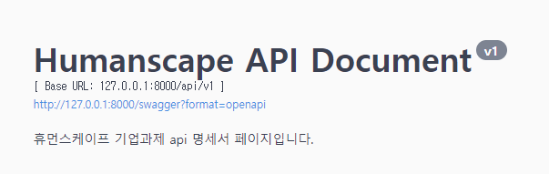

# Team_E_Business Tasks _ Humanscape
원티드 프리온보딩 코스 _ 세번째 기업과제 _ 휴먼스케이프

### 팀 노션 [GoTo](https://rumbling-olive-af4.notion.site/Humanscape-6dd75da669644994bf73d34941e13735)
- 요구사항 분석, 정보 공유 및 프로젝트 진행을 위해 사용

## 과제 해석
Client에게 의료 연구과제를 모아, 필터링과 서치 서비스를 제공하는 과제로 해석하였습니다.

## 구현 요구사항
1.  Github Repository 조건
	- *production key 값 절대 올리지 않도록 유의(히스토리에 남아있을 경우 0점)*
	- *팀원간 동일한 commit 단위*
	- README.md
	    * 개인별 구현 방법과 이유, 어려웠던 점에 대해 간략히 서술
	    * 누구나 따라 할 수 있을 정도의 자세한 실행 방법, 트러블 슈팅 가이드

2. 구현 조건 
	- 구현 방식 - Django/Django Rest Framework + postgreSQL + RESTful

	- [x] 임상정보 수집 batch task
	    * open API [GoTo](https://www.data.go.kr/data/3074271/fileData.do#/API)
	    * open API 데이터 주기적으로 적재하는 기능
	        * 실제 데이터를 추가하면서 중복 방지
	        * 기존 데이터와 API 데이터 간 수정된 사항을 비교해 해당 임상시험이 업데이트 된 것인지 구별
	        * 실행 완료 이후 업데이트 된 건 수 출력/로깅
	- [x] 임상정보 API
	    * 특정 임상정보 조회
	    * 최근 일주일내에 업데이트(변경사항이 있는) 된 임상정보 리스트 조회 + pagination(offset, limit)
	- [x] 직접 API 호출해서 볼 수 있는 API document
	
    * API 형식 예시
	```
		# retrive(read)
		curl https://api.clinicaltrialskorea.com/api/v1/studies/22162/
		# search
		curl https://api.clinicaltrialskorea.com/api/v1/studies/?condition=%EA%B0%84&offset=0&limit=10
	```

3. 가산점 조건
	- [x] 임상 시험 정보를 제공하는 다른 API 발굴해 batch task 추가
	    * 중복되는 임상 시험 merge 가능하다면, 규칙과 과정 명시
	- [x] 배포
	    * 배포 과정에 대한 가이드 + 주소
	- [x] 임상정보 리스트 임의의 파라미터 검색 기능 API

## 구현

### 기술 스택
     

### 개발 기간
- 2022.05.10 - 2022.05.13

### ERD


### API 명세
[See Document](http:localhost/swagger)




### Step to run
[GET API](https://www.data.go.kr/data/3074271/fileData.do#/API%20%EB%AA%A9%EB%A1%9D/GETuddi%3Acfc19dda-6f75-4c57-86a8-bb9c8b103887)
url을 통해 api_key를 받아주세요


##### 1. 리포지터리에서 clone을 합니다
~~~
git clone https://github.com/wanted-team-e/Humanscape.git
~~~

##### 2-1. Pgadmin4에서 application과 연동할 DB를 생성합니다
~~~
1. Servers를 register합니다
2. Database를 생성합니다
~~~


##### 2-2. .env 파일을 루트에 생성 후 Postgresql과 연동을 위한 정보를 담습니다
~~~
SECRET_KEY=''
api_secret_key_1='api_key'

DB_NAME='DB이름'
DB_USER='유저이름'
DB_PASS='비밀번호'
DB_HOST='호스트주소'
~~~

##### 3. 가상환경을 설정한 후 requirement.txt안의 라이브러리를 다운로드 받습니다
~~~
Windows:
1. python -m venv venv
2. venv\Scripts\activate.bat
3. pip install -r requirements.txt

Mac:
1. python -m venv venv
2. source venv\bin\activate
3. pip install -r requirements.txt
~~~

##### 4. Model migrations을 진행합니다
~~~
python manage.py migrate
~~~

##### 5. Cron Job 실행하였습니다
~~~
studies.schedules.py 실행
~~~

##### 6. Django 서버 실행하였습니다
~~~
python manage.py runserver --settings=config.settings.develop
~~~


## Trouble Shooting
##### postgresql서버와 pgadmin 연동 문제
* pgAdmin4: 500 Internal Server Error
    1. 제어판 -> postgresql과 pgadmin 삭제
    2. Postgresql Install (pgadmin함께 설치 체크 해제)
    3. Pgadmin Install


## Author
### 강정희
- Study, Institute model 모델링 및 구현
    - 연구책임기관(institute), 진료과(department)는 타 opent API의 도입에서도 쓰일 수 있도록 확장성을 고려해 따로 테이블화하여 외래키로 선언하고, 데이터베이스에 업로드 될 때 사용되는 timestamp(created_at, updated_at)도 따로 테이블화하여 해당 테이블을 상속해 모델을 구현했습니다.
- List/Retrieve API 구현
    - Django APIView, Django ORM을 이용해 CBV 형식으로 API를 구현했습니다.
    - List API
        - offset, limit를 파라미터로 받아 pagination을 할 수 있도록 구현했습니다.
        - 주 검색대상이 될 것이라 예상한 과제명(title), 과제번호(number), 연구책임기관명(institute)를 파라미터로 받아 데이터베이스 내에서 해당 내용을 like 검색하여 조회할 수 있도록 구현했습니다.
        - 추가적으로 page, page_size를 파라미터로 받아 pagenation을 할 수 있도록 구현했습니다.
- Test Code 작성
    - Pytest, Factoryboy, Faker를 이용해 Model, List/Retrieve API에 대한 test code를 작성했습니다.
    - Model test code
        - 지정된 open API의 내용이 아니라 Factoryboy, Faker를 이용해 임의의 테스트용 모델을 생성해서 Model test를 구현했습니다.
- Swagger 적용
    - 구현했던 List/Retrieve API의 request, response 상세 내용을 추가해 API document를 작성했습니다.

- 어려웠던 점 및 보완할 점
    - API 구현과 Swagger 작성에서, 이전에 API 구현에 적용했던 방식인 ModelViewSet에 비해 함수를 선언해서 상세히 구현해야 했기 때문에 내부 로직을 어느 정도 이해하는데 추가적인 시간이 필요했습니다.
    - 처음 test code를 구현해보았기 때문에 필요한 라이브러리를 설치하는 것부터 어려움이 있었고, 각 라이브러리에 대한 이해도가 낮은 상태로 구현을 시작해서 시행착오가 많았던 것 같습니다.

    - APIView와 Viewset의 구현 방식의 차이, test code 작성에 대해 조금 더 알아보는 시간을 가지면 좋을 것 같고, 배포 과정에 대해서도 상세하게 익힐 시간이 필요할 것 같습니다.

### 이형준

### 서재환
- 배포
    - 배포를 위해 [gunicorn + Nginx + EC2]를 이용하여 진행하였습니다. 처음 배포를 하는 부분이라서 많은 어려움을 겪었습니다. 웹서버 + WAS + Nginx + EC2에 대한 개념 없이 설정에 초점을 맞추어 작업을 진 행하였기 때문에 큰그림을 보지 못하였고 작업을 진행하는데 있어 마주하는 크고 작은 오류에 대해서 도 오류를 해결하기에 급급했습니다. 처음해보는 작업이라는 점으로 인해 두서없이 진행한 부분이 큰 것 같습니다. 다음 과제 때 배포를 맡진 않겠지만 다음에 있을 작업을 할 때에는 크게 보고 개념을 잘 챙기면서 과제를 진행해야 할 것 같습니다.

### 김채욱
* 프로젝트 초기 세팅
    * 요구명세서 해석
    * 개발에 필요한 초기 라이브러리 설치
* Studies 모델링 및 구축
    * 모델 확장성을 위해 과제와 기관 분리
    * 주요 반환 데이터는 과제 모델에서 반환
* List/Retrieve API 구현 
    * drf 내부 함수 이용 (limitoffsetpagination, djangobackendfilter)
    * 기능 구현은 되었지만, 자체적으로 함수 구현의 필요성을 주석처리
- 어려웠던 점 및 보완할 점
	- 데이터베이스 정규화와 비즈니스 모델 사이의 합의점을 찾는 과정이 어려웠습니다.
		- 개발의 관점에서 데이터 중복과 정확성에 문제가 생길수도 있는 구조이지만, 이를 해결하기 위해 테이블을 분리할시 기능 구현 및 query 성능에 문제가 생겼습니다.
		- 서비스의 이해가 완전하지 않고 모델링을 짤 경우, 이후 모델 확장성 부분에서 주관적인 요소가 너무 많이 개입될 수 있었던것 같습니다.