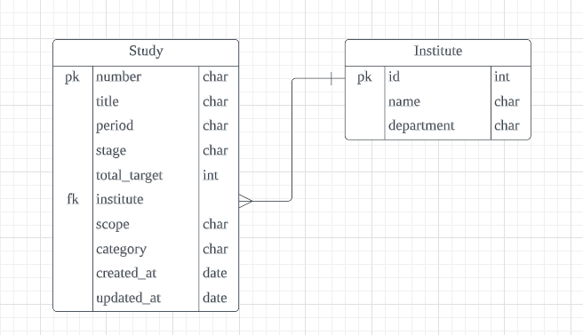

# Team_E_Business Tasks _ Humanscape
원티드 프리온보딩 코스 _ 세번째 기업과제 _ 휴먼스케이프

### 팀 노션 [GoTo](https://rumbling-olive-af4.notion.site/Humanscape-6dd75da669644994bf73d34941e13735)
- 요구사항 분석, 정보 공유 및 프로젝트 진행을 위해 사용

## 과제 해석
Client에게 의료 연구과제를 모아, 필터링과 서치 서비스를 제공하는 과제로 해석하였습니다.

## 구현 요구사항
1.  Github Repository 조건
	- *production key 값 절대 올리지 않도록 유의(히스토리에 남아있을 경우 0점)*
	- *팀원간 동일한 commit 단위*
	- README.md
	    * 개인별 구현 방법과 이유, 어려웠던 점에 대해 간략히 서술
	    * 누구나 따라 할 수 있을 정도의 자세한 실행 방법, 트러블 슈팅 가이드

2. 구현 조건 
	- 구현 방식 - Django/Django Rest Framework + postgreSQL + RESTful

	- [x] 임상정보 수집 batch task
	    * open API [GoTo](https://www.data.go.kr/data/3074271/fileData.do#/API)
	    * open API 데이터 주기적으로 적재하는 기능
	        * 실제 데이터를 추가하면서 중복 방지
	        * 기존 데이터와 API 데이터 간 수정된 사항을 비교해 해당 임상시험이 업데이트 된 것인지 구별
	        * 실행 완료 이후 업데이트 된 건 수 출력/로깅
	- [x] 임상정보 API
	    * 특정 임상정보 조회
	    * 최근 일주일내에 업데이트(변경사항이 있는) 된 임상정보 리스트 조회 + pagination(offset, limit)
	- [ ] 직접 API 호출해서 볼 수 있는 API document
	
    * API 형식 예시
	```
		# retrive(read)
		curl https://api.clinicaltrialskorea.com/api/v1/studies/22162/
		# search
		curl https://api.clinicaltrialskorea.com/api/v1/studies/?condition=%EA%B0%84&offset=0&limit=10
	```

3. 가산점 조건
	- [x] 임상 시험 정보를 제공하는 다른 API 발굴해 batch task 추가
	    * 중복되는 임상 시험 merge 가능하다면, 규칙과 과정 명시
	- [ ] 배포
	    * 배포 과정에 대한 가이드 + 주소
	- [x] 임상정보 리스트 임의의 파라미터 검색 기능 API

## 구현

### 기술 스택
     

### ERD


#### API 명세
http:localhost/swagger

### Step to run
~~~
Windows
$ python -m venv venv
$ venv/Scripts/activate.bat
$ python install -r requirements.txt
$ python manage.py runserver

Mac
$ python -m venv venv
$ source venv/Scripts/activate
$ python install -r requirements.txt
$ python manage.py runserver

Test code
전체실행: $ pytest
부분실행: $ pytest test_path::실행함수
~~~

## Trouble Shooting
* postgresql서버와 pgadmin4 연동
    - 에러메시지: pgAdmin4: 500 Internal Server Error 
    - 해결: 설치시 postgresql 설치 이후 pgadmin를 설치

## Author
### 강정희
### 이형준
### 서재환
### 김채욱